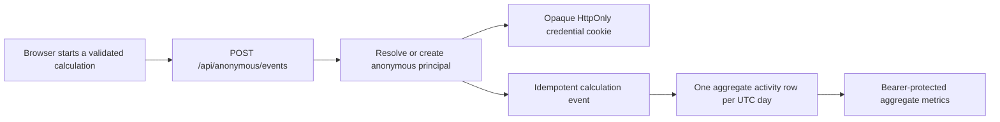

# Anonymous principals and usage measurement

## Purpose and measurement contract

CompLearn lets a person use the calculator without signing in. The application still needs a durable, server-authorized identity so it can count meaningful product use now and own cloud workspaces later. This implementation calls that identity an **anonymous principal**.

An anonymous principal represents one browser installation that retains its first-party cookie. It does not prove that one human used the browser. The same person on two devices counts as two anonymous installations, a shared browser can represent several people, and clearing site data or using private browsing creates a new installation. Public reports must therefore use names such as **activated anonymous installations**, **monthly active installations**, and **registered accounts**. They must not describe the anonymous count as exact unique humans.

The principal is created only when the browser submits a validated calculation event or explicitly prepares a future cloud session. Merely loading the marketing page does not activate a principal. This keeps crawlers and casual page loads out of the primary product metric.

Implementation updated: 2026-08-10 (Asia/Ho_Chi_Minh).

## Runtime flow



The frontend creates a random calculation `runId` and sends one `calculation_started` event after the input has passed validation. It sends `calculation_completed` only after QSearch returns a valid tree. Anonymous reporting is deliberately fail-open: a network or metrics failure is logged in the browser but never makes a local scientific calculation fail.

The backend validates an exact allowlist of five event fields. Labels, filenames, sequence data, uploaded contents, NCD matrices, content hashes, browser fingerprints, IP addresses, referrers, and arbitrary metadata are not accepted by the anonymous event endpoint.

## Credential design

When no valid credential exists, the backend generates:

- a UUIDv7 principal identifier, used only on the server and in database relations;
- 32 cryptographically random bytes encoded as a base64url credential; and
- a SHA-256 hash of that credential for database lookup.

Only the hash is stored in MySQL. The raw credential is returned in a first-party cookie. Production uses:

```text
__Host-complearn_anonymous=<opaque 256-bit credential>
Path=/; Max-Age=31536000; Secure; HttpOnly; SameSite=Lax
```

The `__Host-` prefix prevents a `Domain` attribute and requires HTTPS, `HttpOnly` keeps ordinary JavaScript from reading the credential, and `SameSite=Lax` prevents the credential from accompanying ordinary cross-site subrequests. The API additionally rejects requests explicitly marked `Sec-Fetch-Site: cross-site` and rejects a supplied `Origin` that differs from `FRONTEND_BASE_URL`.

Development and tests use `complearn_anonymous` without `Secure` so local HTTP works. Production and development cookie namespaces intentionally differ.

Credentials last one year. An active credential is renewed only when it has fewer than 30 days remaining, avoiding a database and `Set-Cookie` write on every calculation. Expired, malformed, unknown, or revoked credentials create a new principal. A credential is a bearer secret and must never be logged, placed in a URL, exposed to an analytics vendor, or used outside HTTPS production traffic.

## Database tables

### `anonymous_principals`

This is the authoritative installation registry.

| Column | Meaning |
| --- | --- |
| `id` | Server-side UUIDv7 principal ID |
| `credential_hash` | SHA-256 credential hash; nullable after expiry cleanup |
| `credential_expires_at` | Server-side credential expiry |
| `activated_at` | First accepted calculation start or completion |
| `first_completed_at` | First accepted completed calculation |
| `last_seen_at` | Last observed activity, updated at most once per UTC day outside events |
| `created_at`, `updated_at` | Database record timestamps |

The count of rows with `activated_at IS NOT NULL` is the all-time activated-installation count. The count with `first_completed_at IS NOT NULL` is the all-time completed-installation count. These queries avoid an expensive all-time `COUNT(DISTINCT event.principal_id)`.

### `anonymous_calculation_events`

This append-only table contains only `id`, `principal_id`, `run_id`, `event_type`, `input_kind`, `object_count`, and the server-controlled `occurred_at`. The unique constraint on `(principal_id, run_id, event_type)` makes browser retries idempotent. Reusing an event ID or run/type tuple with different data returns HTTP `409` rather than silently modifying the original observation.

### `anonymous_activity_days`

The composite primary key `(principal_id, activity_date)` permits at most one row per installation per UTC date. The row contains calculation-start and calculation-completion counters. Monthly active installations are therefore counted from a compact daily table rather than the raw event stream.

The models are in `complearn-genbank/models`, and the existing production startup calls `sequelize.sync()`. Because these are new tables, startup creates them without altering the existing user tables. Future changes to deployed table shapes should use explicit versioned migrations rather than relying on schema alteration at startup.

## HTTP API

### `POST /api/anonymous/session`

Creates or resumes an anonymous principal without activating it. This is intended for a future cloud-save flow that needs an owner before the first calculation event.

- `201 {"ready":true,"created":true}`: new principal and cookie.
- `200 {"ready":true,"created":false}`: existing principal.
- `403`: explicit cross-site request.
- `503`: database or identity service unavailable.

### `POST /api/anonymous/events`

The only accepted request body is:

```json
{
  "eventId": "79ce4c3c-8408-4d56-90b1-0a15a94b5814",
  "runId": "dc034a6a-a564-43a3-b35e-b2e1a1e749ae",
  "eventType": "calculation_started",
  "inputKind": "objects",
  "objectCount": 4
}
```

`eventType` is `calculation_started` or `calculation_completed`; `inputKind` is `objects` or `distance-matrix`; and `objectCount` is an integer from 4 through 10,000. Unknown and missing fields are rejected.

- `202 {"accepted":true,"duplicate":false}`: recorded.
- `200 {"accepted":true,"duplicate":true}`: idempotent retry.
- `400`: malformed or disallowed event.
- `403`: explicit cross-site request.
- `409`: identifier conflict.
- `503`: persistence unavailable.

### `GET /api/anonymous/metrics`

This endpoint is unavailable when `ANONYMOUS_METRICS_TOKEN` is unset. The configured token must contain at least 32 bytes of random ASCII data and is compared in constant time. Send it only in the authorization header:

```bash
curl \
  -H "Authorization: Bearer ${ANONYMOUS_METRICS_TOKEN}" \
  https://openscienceresearchpark.com/api/anonymous/metrics
```

The response reports its semantics explicitly:

```json
{
  "semantics": "anonymous-browser-installations",
  "generatedAt": "2026-08-10T00:00:00.000Z",
  "windowStart": "2026-07-12",
  "totals": {
    "issuedInstallations": 1200,
    "activatedInstallations": 760,
    "completedInstallations": 610,
    "calculationStarts": 2400,
    "calculationCompletions": 1900
  },
  "last30Days": {
    "activeInstallations": 280
  }
}
```

`windowStart` and activity dates use UTC. The 30-day window includes today and the preceding 29 UTC dates.

## Deployment and operations

Set a randomly generated metrics token in `complearn-genbank/.env.production` or the deployment secret manager:

```text
ANONYMOUS_METRICS_TOKEN=<at-least-32-random-characters>
```

The frontend and API should remain same-origin in production, as the current `/api` routing already supports. Confirm HTTPS before release and verify that the production response uses `__Host-complearn_anonymous`, `Secure`, `HttpOnly`, `SameSite=Lax`, and `Path=/`.

The GitHub Pages build that points at a backend on another registrable domain cannot use this cookie safely: the browser treats that request as cross-site and the API rejects it. Anonymous metrics for that deployment therefore remain fail-open and unrecorded. Put the public calculator and `/api` behind the same site, or proxy the API through the public site, before treating the dashboard as complete product usage.

The edge proxy must rate-limit principal creation and event submission. A suitable starting policy is approximately 10 new session requests per IP per minute with a small burst and a larger limit for idempotent event posts. Rate limiting belongs at the shared reverse proxy or CDN so all API replicas observe the same policy. The application deliberately does not persist an IP-derived identifier.

The cookie and database row are pseudonymous product identifiers, not a claim of legal anonymity. Publish the measurement purpose, retention period, deletion process, and cloud-storage boundary in the product privacy notice, and review the applicable consent or lawful-basis requirements for each deployment jurisdiction. This technical design deliberately avoids making a universal legal-compliance claim.

Back up the three tables with the rest of MySQL. Alert on elevated `503`, `400`, or `409` rates and on an abnormal ratio of issued to activated installations. A sudden rise in issued-but-never-activated principals is usually automation, invalid cookies, or a broken frontend integration.

After a credential has expired, its lookup hash is no longer needed. A scheduled privacy cleanup can remove expired credentials while retaining aggregate principal history:

```sql
UPDATE anonymous_principals
SET credential_hash = NULL,
    credential_expires_at = NULL
WHERE credential_expires_at < UTC_TIMESTAMP();
```

Unactivated expired principals may be deleted after the chosen retention period. Activated principals should remain if the product promises an all-time activated-installation metric; otherwise, first preserve the required aggregate and document the retention boundary. Raw calculation events can receive a finite retention period after daily counters and financial reporting requirements are verified.

## Future cloud projects and account claiming

Anonymous identity makes cloud storage possible without a login wall, but it does not provide recovery. A user who loses the cookie cannot recover anonymous work from another device. The cloud feature should therefore use these entities:

```text
workspaces(id, created_at)
workspace_principals(workspace_id, principal_id, role)
projects(id, workspace_id, encrypted_payload, created_at, updated_at)
workspace_accounts(workspace_id, provider_name, user_login_id, role)
```

On the first explicit **Save to cloud** action, the server resolves the cookie, creates a workspace and principal membership in one transaction, applies an anonymous storage quota, then stores the project. Scientific input data must never be uploaded merely because usage activity was recorded; cloud upload requires a separate, visible user action and its own privacy explanation.

When the person later signs in, claim the workspace transactionally by adding the authenticated account membership. Keep the anonymous principal relation long enough to make retries safe, but make the account the recoverable owner. If the account already owns a workspace, use a documented merge policy and idempotency key. Do not rewrite historical activity or use an analytics vendor's `distinct_id` as authorization.

Cross-device recovery, collaboration, billing, and deletion requests require a permanent account, passkey, verified email link, or another recoverable authentication method. Anonymous principals remove the initial login wall; they do not eliminate the need for stronger identity when the product begins making durable promises to a user.

## Verification

Backend coverage verifies credential hashing, cookie reuse and renewal, idempotent start/completion events, rejection of arbitrary research metadata, aggregate metrics authorization, and cross-site rejection:

```bash
cd complearn-genbank
npm run build
npm test -- --runInBand __tests__/anonymousPrincipal.test.ts
```

Frontend coverage verifies the exact allowlisted payload, credentialed requests, explicit session preparation, and fail-open reporting:

```bash
cd ncd-calculator
npm run typecheck
npm test -- src/__test__/anonymousActivity.test.ts
npm run build
```
