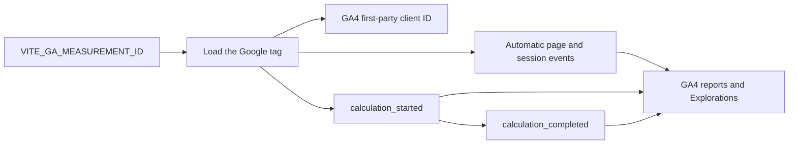

# Google Analytics usage measurement

## Purpose and boundary

CompLearn uses Google Analytics 4 (GA4) to measure visits and calculator activation without requiring a login or maintaining an application analytics database. GA4 provides the collection service, approximate distinct-user metrics, standard reports, Realtime, and Explorations.

This measurement is deliberately separate from application authorization. A GA client ID cannot own a cloud project, enforce a quota, recover work on another device, or be trusted as a server credential. A future cloud-save feature will still require a server-authorized anonymous principal, an account, or another recoverable identity. The GA client ID must never be accepted by the backend as proof of ownership.

Implementation updated: 2026-08-10 (Asia/Ho_Chi_Minh).

## Counting semantics

The Google tag stores a random client ID in the first-party `_ga` cookie when analytics storage is granted. GA4 uses that device/browser identifier to calculate user metrics. CompLearn does not create or send a custom user ID.

The useful product metrics are:

| Metric | GA4 interpretation |
| --- | --- |
| Visitors | `Total users` or `Active users` across automatically collected events |
| New browser visitors | `New users`, populated by `first_visit` |
| Activated calculator users | `Total users` filtered to `calculation_started` |
| Users who completed a result | `Total users` filtered to `calculation_completed` |
| Calculation attempts | Event count for `calculation_started` |
| Completed calculations | Event count for `calculation_completed` |

These are approximate browser/device users, not exact humans. One person using two browsers can count twice, several people sharing one browser can count once, and clearing cookies creates a new client ID. Ad blockers, network failures, consent choices, and disabled cookies reduce the observed count. GA4 can also use modeled or approximate reporting; Google documents HyperLogLog++ for many distinct-count reports. Public claims should therefore use wording such as **measured calculator users** or **browser users**, not “verified unique people.”

GA4 Standard currently permits up to 14 months of event-level retention for Explorations. Standard aggregate reports and user-lifetime surfaces have different behavior and limits. If a durable audited all-time financial metric becomes necessary, export periodic aggregates to an owned reporting system rather than treating a free dashboard as an immutable ledger.

## Runtime flow



`src/main.tsx` initializes the tag before rendering the application. If the measurement ID is absent or invalid, initialization is a no-op and the application behaves normally. The measurement ID is a public routing identifier, not a secret.

The calculator sends `calculation_started` only after labels and input structure pass validation. It sends `calculation_completed` only after QSearch returns a valid tree. Analytics is fail-open: blocked or unavailable analytics never prevents a local calculation.

## Data contract

Each custom event contains only:

```json
{
  "event_name": "calculation_started",
  "input_kind": "objects",
  "object_count": 4
}
```

`input_kind` is `objects` or `distance-matrix`. `object_count` is the number of compared objects. The Google tag also collects its documented default web fields, including page location, page title, referrer, language, and device/browser information according to the GA4 property settings.

CompLearn does not send labels, accession IDs, filenames, sequence contents, uploaded data, matrices, distances, content hashes, exported experiment data, email addresses, account IDs, or a custom user ID. Do not add high-cardinality run identifiers or scientific-input metadata as event parameters.

The code sets advertising storage, advertising user data, and ad personalization consent to `denied`. It also disables Google Signals and ad-personalization signals in the tag configuration. Analytics storage is `granted` because the requested browser-level user count depends on the first-party client ID.

## Deployment

1. Create a GA4 property and a Web data stream for the production site.
2. Copy its measurement ID, which has the form `G-XXXXXXXXXX`.
3. Set the build-time frontend variable:

   ```text
   VITE_GA_MEASUREMENT_ID=G-XXXXXXXXXX
   ```

4. Rebuild and deploy the frontend. Vite embeds this public value in the JavaScript bundle.
5. Visit the deployed site and verify `page_view` and `calculation_started` in Realtime or with Google Tag Assistant.
6. In GA4 Admin, review data retention, internal-traffic filters, unwanted referrals, granular location/device collection, data sharing, and enhanced measurement.

Local development and CI should normally leave the variable unset so they do not pollute production analytics. Use a separate GA4 property or data stream when end-to-end analytics testing is necessary.

## Dashboard setup

The default GA4 reports show visitors, acquisition, engagement, pages, geography, and technology after the tag begins collecting. Realtime usually appears within minutes; standard report processing can take longer.

For the core activation view, create an Exploration with `Event name` as a dimension and `Total users` plus `Event count` as metrics. Filter event names to `calculation_started` and `calculation_completed`. This separates users who merely visit from users who use the calculator. Optionally mark `calculation_completed` as a key event.

To report the two custom parameters, register `input_kind` as an event-scoped custom dimension and `object_count` as an event-scoped custom metric. GA4 does not retroactively populate newly registered custom definitions, so configure them before relying on those breakdowns.

## Privacy and consent operations

Enabling the measurement ID causes the browser to contact Google and permits analytics storage. Before production enablement, update the public privacy notice with the measurement purpose, provider, fields collected, retention, cookie behavior, opt-out or deletion process, and applicable international-transfer information. Determine whether consent is required for each deployment jurisdiction and integrate a consent-management platform when required. Leaving `VITE_GA_MEASUREMENT_ID` unset is the fail-safe way to ship with no GA collection until that work is complete.

Google Analytics is hosted infrastructure rather than zero-cost ownership. It removes the application database and dashboard maintenance, but it introduces a third-party processor, browser blocking, service limits, policy obligations, and vendor dependence. Access to the GA property should use least privilege and organization-controlled accounts.

Relevant Google documentation:

- [Install the Google tag](https://developers.google.com/tag-platform/gtagjs)
- [Set up GA4 events](https://developers.google.com/analytics/devguides/collection/ga4/events)
- [Google tag API and consent fields](https://developers.google.com/tag-platform/gtagjs/reference)
- [GA4 default data collection](https://support.google.com/analytics/answer/11593727)
- [GA4 user metrics](https://support.google.com/analytics/answer/12253918)
- [GA4 configuration limits](https://support.google.com/analytics/answer/12229528)

## Verification

```bash
cd ncd-calculator
npm test -- src/__test__/googleAnalytics.test.ts
npm run lint
npm run build
```

The unit test verifies disabled and invalid configuration, one-time tag loading, analytics-only consent defaults, advertising-signal controls, and the exact custom-event allowlist.
